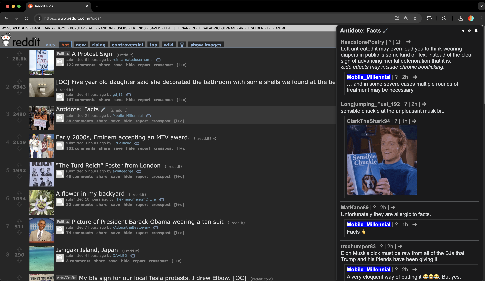

# Reddit Comment Companion

A browser extension that helps you navigate and interact with Reddit comments more efficiently.

> 

## Features

- Shows Reddit comments in a sidebar instead of having to open new tab
- Supports full markdown, images, gifs
- Hover over the "Comments" button of any post to load comments
- Currently only old Reddit. Works with RES
- Collapsing comments
- Post voting buttons (upvote/downvote) that open Reddit for voting

## Install

<a href="https://chromewebstore.google.com/detail/reddit-comment-companion/dlndocheomidkojgikfbbfppcojgliab">
<a href="https://addons.mozilla.org/firefox/addon/reddit-comment-companions/">

### From Source

1. Clone this repository
2. Install dependencies with `pnpm install`
3. Build the extension with `pnpm build`
4. Load the unpacked extension in your browser:
   - Chrome: Go to `chrome://extensions/`, enable Developer mode, and click "Load unpacked"
   - Firefox: Go to `about:debugging#/runtime/this-firefox` and click "Load Temporary Add-on"

## Development

This project uses:
- [Plasmo](https://www.plasmo.com/) for browser extension development
- React for the user interface
- TypeScript for type safety
- SCSS for styling

### Commands

```bash
# Install dependencies
pnpm install

# Start development server
pnpm dev

# Build for production
pnpm build
```

## Contributing

Contributions are welcome! Feel free to open issues or submit pull requests to help improve this extension.

## Acknoledgements

Based on the no longer maintained [`richmondwatkins/RedditCommentCompanion`](https://github.com/richmondwatkins/RedditCommentCompanion). Rebuilt from scratch.
